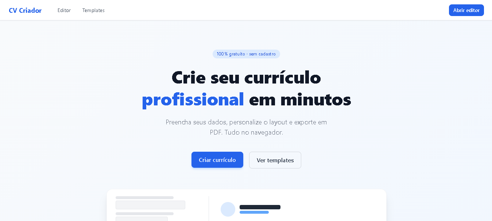
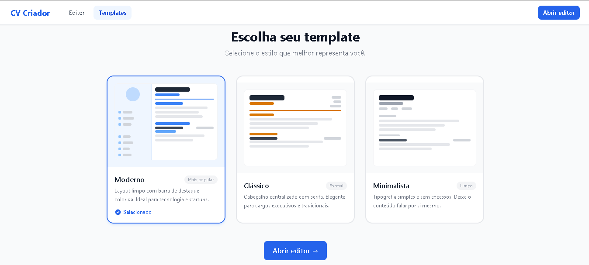
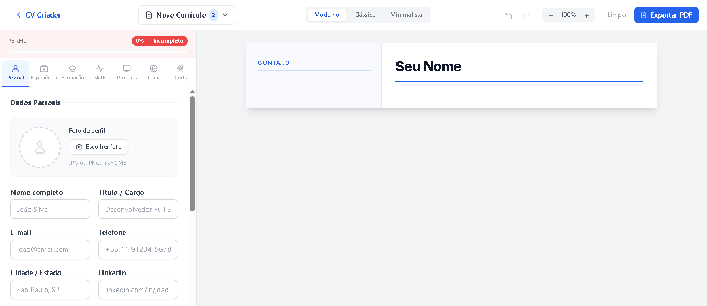
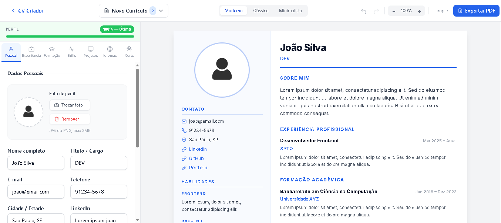
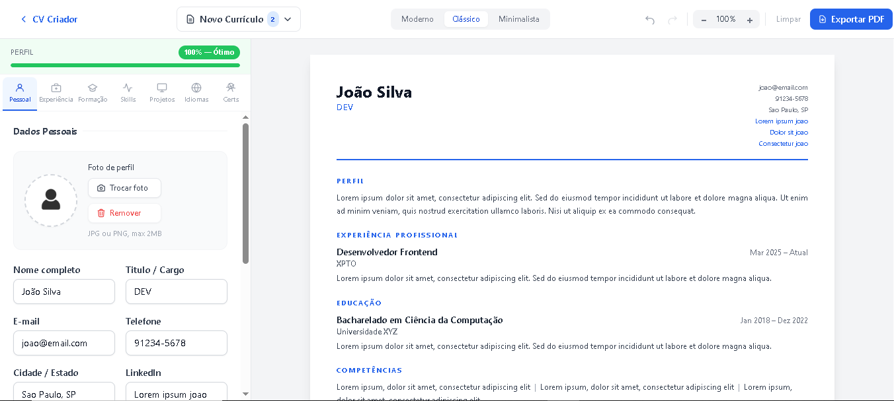
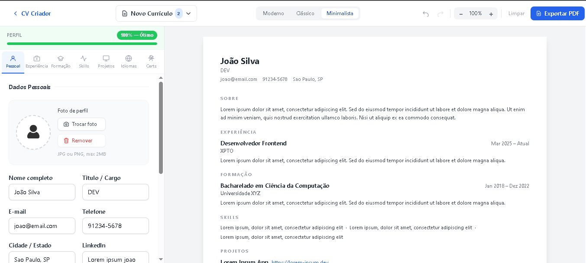

<h1 align="center">Resume Builder</h1>

<p align="center">
  Crie currículos profissionais em minutos — com preview ao vivo, múltiplos templates e exportação em PDF.
</p>

<p align="center">
  
  
  
  
</p>

---

## Screenshots

### Página inicial


### Galeria de templates


### Editor com preview ao vivo


<details>
<summary>Ver templates individuais</summary>

### Template Moderno


### Template Clássico


### Template Minimalista


</details>

---

## Funcionalidades

| Recurso | Descrição |
|---|---|
| **Editor ao vivo** | Preencha os dados e veja o currículo atualizar em tempo real |
| **3 templates** | Moderno, Clássico e Minimalista |
| **Exportação em PDF** | Gera um arquivo A4 pronto para envio |
| **Cor personalizada** | Escolha a cor de destaque do currículo |
| **Foto de perfil** | Upload direto no editor |
| **Auto-save** | Dados salvos automaticamente no navegador |
| **Drag & drop** | Reordene seções livremente |

---

## Como rodar

```bash
# Instalar dependências
npm install

# Iniciar servidor de desenvolvimento
npm run dev

# Build para produção
npm run build
```

Acesse em **http://localhost:5173**

---

## Páginas

| Rota | Descrição |
|------|-----------|
| `/` | Página inicial |
| `/templates` | Galeria de templates |
| `/editor` | Editor completo com preview |

---

## Tecnologias

- [React 18](https://react.dev/) + [Vite](https://vitejs.dev/)
- [Tailwind CSS](https://tailwindcss.com/)
- [Zustand](https://zustand-demo.pmnd.rs/) — estado global
- [React Hook Form](https://react-hook-form.com/) — formulários
- [dnd-kit](https://dndkit.com/) — drag & drop
- [jsPDF](https://github.com/parallax/jsPDF) + [html2canvas](https://html2canvas.hertzen.com/) — exportação PDF
- [React Router DOM v6](https://reactrouter.com/) — roteamento
